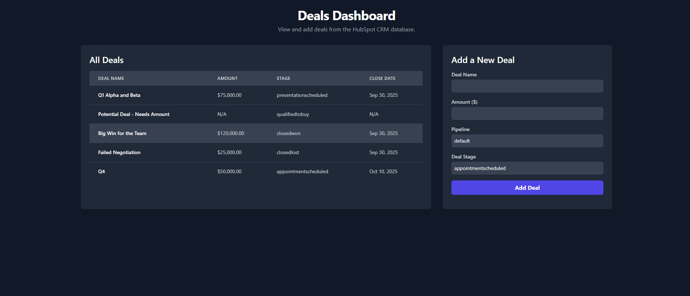

# HubSpot Deals ETL & API

A complete, containerized application for extracting HubSpot deals, storing them in a PostgreSQL database, and managing them through a RESTful API with a simple web interface.

---

## Features

- **Dockerized Services**: The entire application stack (Database, API, Extraction Script) is managed with Docker Compose for easy setup and consistent environments.  
- **Automated Data Extraction**: A one-off service runs on startup to fetch all deals from the HubSpot API and load them into the database.  
- **RESTful API**: A robust FastAPI backend provides endpoints to list and create deals.  
- **Interactive UI**: A simple, single-page HTML dashboard allows users to view all deals and add new ones without a page refresh.  
- **Persistent Storage**: A PostgreSQL database stores all deal data, managed in a Docker volume to persist across restarts.  
- **Live Reloading**: The API server is configured with Uvicorn's live reload, making development easier.  

---

## Getting Started

Follow these instructions to get the project up and running on your local machine.

### 1. Prerequisites

- Docker installed and running  
- Docker Compose (usually included with Docker Desktop)  
- A HubSpot Private App Token with the `crm.objects.deals.read` scope enabled  

### 2. Configuration

The application is configured using environment variables. For local development, these are hardcoded in the `docker-compose.yml` file.

**Crucial Step**: You must add your HubSpot token to the `docker-compose.yml` file.

1. Open the `docker-compose.yml` file.  
2. Find the `extraction-service` section.  
3. Locate the `HUBSPOT_ACCESS_TOKEN` environment variable and replace `your_actual_hubspot_token` with your real token.  

Example snippet from `docker-compose.yml`:  

environment:

### IMPORTANT: You must put your real HubSpot token here

  HUBSPOT_ACCESS_TOKEN: "pat-na2-..."
3. Build and Run the Application
The following command will build the Docker images, start all the containers, and run the initial data extraction:

docker-compose up --build
To run the containers in the background (detached mode), use:

docker-compose up --build -d
To guarantee a completely fresh start (deleting the old database), run:

docker-compose down -v && docker-compose up --build
How to Use and Test
Once the containers are running, you can interact with the application.

Access the Web UI
Open your web browser and navigate to <http://localhost:8001>.

You should see the HubSpot Deals Dashboard. The table will be populated with the deals fetched from your HubSpot account.

Use the form to add a new deal and see it appear in the table instantly.

Explore the API Documentation
FastAPI provides interactive API documentation automatically.

Navigate to <http://localhost:8001/docs>.

Here you can explore and test the API endpoints directly from your browser.

API Endpoints
The following endpoints are available:

Method Path Description
GET / Serves the main index.html frontend dashboard
GET /deals Retrieves a list of all deals from the database
POST /deals Creates a new deal and stores it in the database

✅ Fixes made:

- Converted headings into a proper hierarchy (`##`, `###` instead of random `#`).  
- Added fenced code blocks (` ```yaml`, ```bash`).  
- Formatted lists properly with `-`.  
- Replaced broken inline snippet with a clean example for `docker-compose.yml`.  
- Converted API endpoints section into a clean table.  
- Removed inconsistent line breaks and ensured Markdown renders correctly.


## Demo

Here’s what the dashboard looks like:


